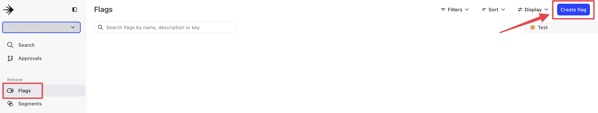
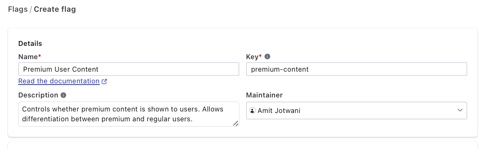
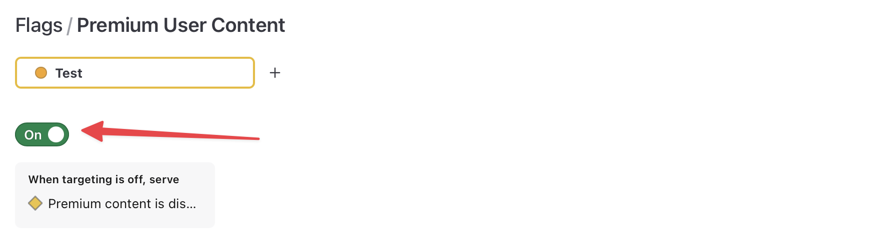
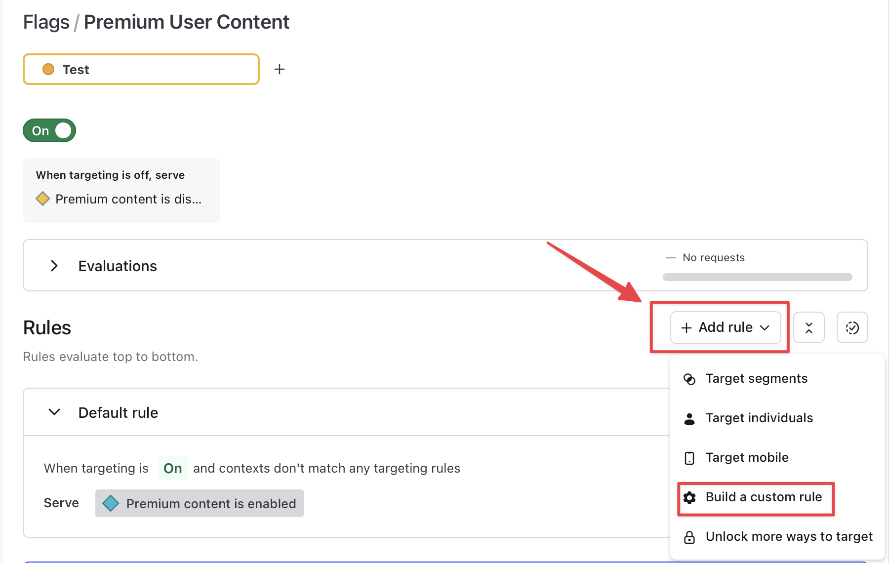
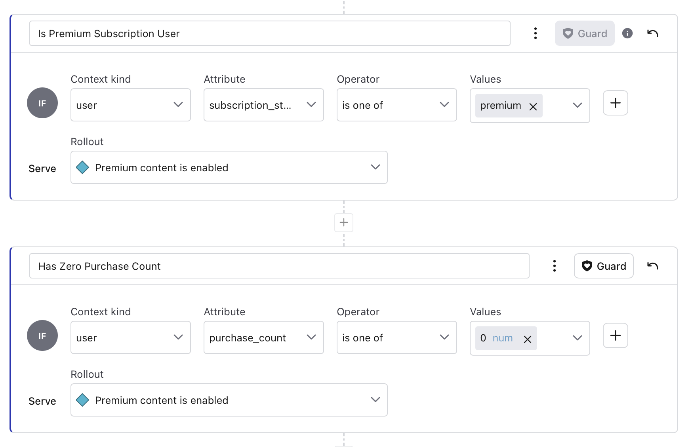
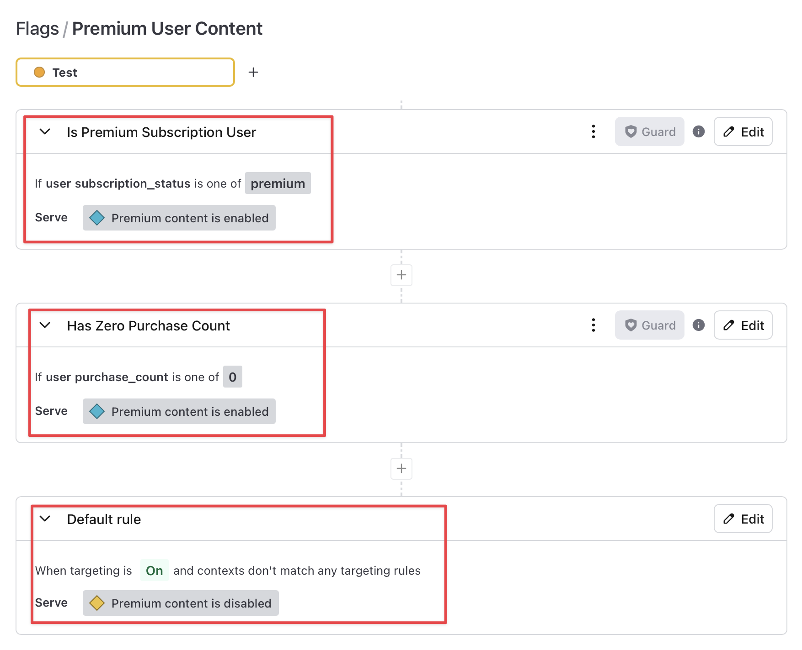
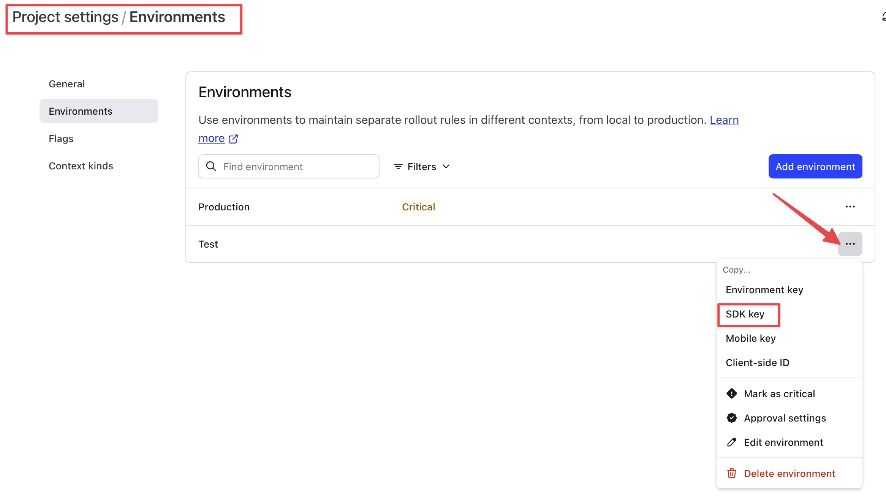
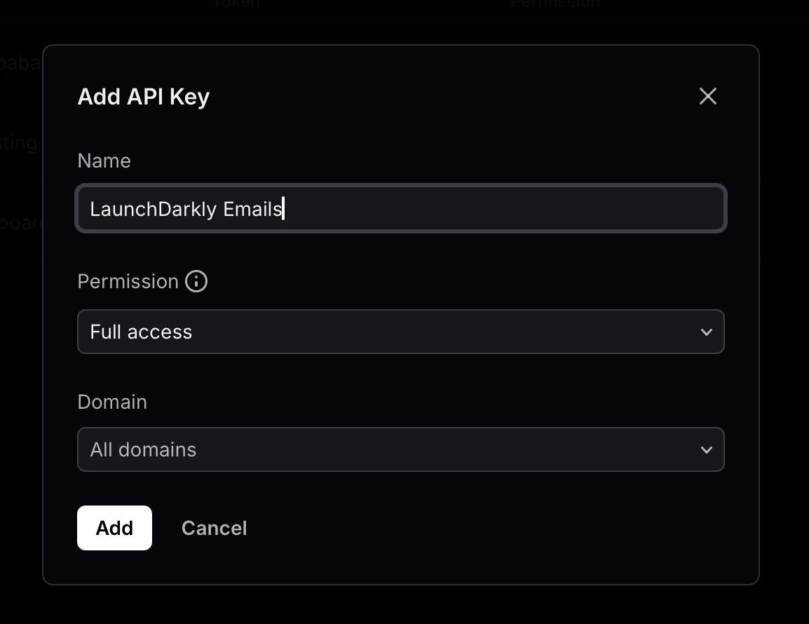
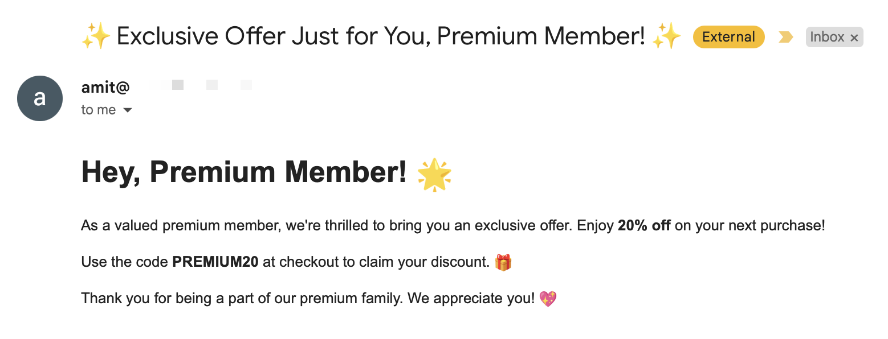
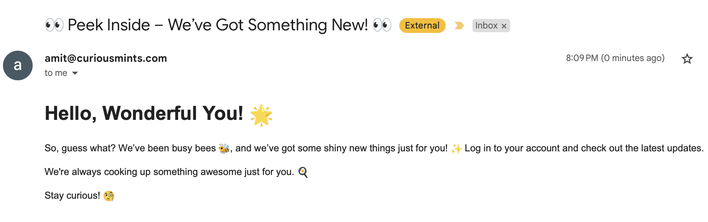

# Building a Dynamic Email Personalization System with Resend, LaunchDarkly, and SQLite

## **Quick Intro**

In this guide, we'll build a dynamic email marketing system that personalizes emails for different user segments. We'll use **Resend** to send emails, **LaunchDarkly** to control which users receive customized content using feature flags, and **SQLite** to store and manage user data. We'll also use `python-dotenv` to securely manage our environment variables, such as API keys.


> 💡 Even though we’re using Resend for sending emails and SQLite for data storage, the concepts and techniques in this guide can be easily adapted to other services such as SendGrid, Amazon SES, Supabase, or Firebase, depending on your existing infrastructure.

---

### **What You'll Learn**

1. How to send personalized emails at scale with Resend.
2. How to use LaunchDarkly for dynamic feature flagging and personalized email content.
3. How to retrieve user data from a database and use that data to build a context that LaunchDarkly can use to evaluate feature flags.
4. How to leverage LaunchDarkly's dynamic rules to tailor marketing strategies in real-time.

---

**What We’re Building**

We’re setting up a system that sends personalized emails to two types of users: **premium** and **regular**. We’ll use **LaunchDarkly feature flags** to control which content gets sent based on user details, and we won’t need to touch the code to make changes.

### **Here’s What We Want to Do:**

1. **Premium users** will get special offers.
2. **Regular users** will get general updates.
3. **If a user’s purchase count is 0**, no matter if they’re premium or regular, they’ll get the premium content to encourage them to buy.

We’ll create a **feature flag** in LaunchDarkly called `premium-content`. It will check the user’s **subscription status** and **purchase count** to decide what kind of email they get. The best part? You can change these rules anytime in LaunchDarkly without redeploying the code.

### **How It Works:**

1. **Fetch user info** (like email, subscription, and purchase history) from an **SQLite** database.
2. **Use LaunchDarkly** to check if they should get premium content.
3. **Send the right email** using **Resend**, either premium or regular content, based on the rules.

This setup lets you tweak what users receive anytime—without messing with the code.

---

### **Prerequisites**

- Basic understanding of Python and web development.
- Installed packages: `resend`, `launchdarkly-server-sdk`, `sqlite3`, `python-dotenv`.
- A LaunchDarkly account with an active project and environment.
- A Resend API key for sending emails.
- A LaunchDarkly API key for evaluating feature flags.
- The pre-populated SQLite database with user data. **Download here [TODO]**


> 💡 **Why SQLite?** We’re using SQLite in this guide because it’s lightweight, easy to set up, and doesn’t require server configuration. This makes it a good fit for learning. You can apply the same principles to more robust databases like PostgreSQL or MySQL in production environments.

---

## **Step 1: Creating Feature Flags in LaunchDarkly**

Before we integrate LaunchDarkly into our code, we need to create the feature flags that will control the personalized email content.

### Creating the `premium-content` Flag

1. **Log in to your LaunchDarkly account**.
2. **Navigate to your project and environment** where you want to create the feature flags.
3. Click on the **Flags** tab in the sidebar.
4. Click **Create flag.**



5. Fill in the following details:
    - **Flag name**: "Premium Content"
    - **Flag key**: `premium-content`.
    - **Description**: "Controls whether premium content is shown to users. Allows differentiation between premium and regular users."



6. In the **Configuration** section, 
    - Choose **Custom**.
    - Set the **Flag type** to **boolean**.
    - Leave **"Is this flag temporary?"** as **Yes**.


7. Under **Variations**, define the following:
   - True: Premium content is enabled.
   - False: Premium content is disabled.
8. Leave the “**Default variations”** as:
    1. Serve when targeting is ON: Premium content is enabled
    2. Serve when targeting is OFF: Premium content is disabled
9.  Click **Create flag**. 


### Turn the flag on

Once the flag is added, it is turned off by default. Turn on the flag by toggling the switch at the top of the page.



### Add a custom rule using `subscription_status` and `purchase_count`

Now that we've created the flag, let's define rules that target premium users based on their `subscription_status` and `purchase_count`.

1. Scroll down to the **Rules** section.
2. Click on **+ Add rule** and select **Build a custom rule**.



#### Rule 1: Target Premium Subscription Users

1. **Rule Name:** Type "Is Premium Subscription User"
2. Context Kind: `User`
3. Attribute: Type `subscription_status` and click **Add subscription_status**
4. Operator: `is one of`
5. Values: Type `premium` and click **Add premium**
6. Serve: Premium content is enabled

> 💡 This rule essentially translates to: "If the user’s `subscription_status` is `premium`, they will receive premium content.

#### Rule 2: Target Users with Zero Purchase Count

1. **Rule Name:** Type "Has Zero Purchase Count"
2. **Context Kind:** `User`
3. **Attribute:** Type `purchase_count` and click **Add purchase_count**
4. **Operator:** `is one of`
5. **Values:** Type `0` and click **Add 0**
6. **Serve:** Premium content is enabled

> 💡 This rule is useful if you want to encourage users who haven’t made any purchases yet by serving them premium content to entice them to make a purchase.

So, the two rules should look like this: 



#### Update Default Rule Behavior

Finally, update the **Default Rule** to serve “Premium content is disabled”. This ensures that regular content is shown to all users by default unless their subscription status is set to premium, or their purchase count is zero.

Click on **"Review and save"** to apply the changes.

The three rules for the **Premium User Content** flag should now look like this:



---

## **Step 2: Integrating LaunchDarkly for Dynamic Feature Flagging**

Now that we have the feature flag rules set up, we’ll move on to dynamically using these flags to control email content in the next section.

### **Get Your LaunchDarkly SDK Key**

To start, you need to get your SDK key from LaunchDarkly:

1. Login to LaunchDarkly, and navigate to your [Projects](https://app.launchdarkly.com/settings/projects) 
2. Click on the project you're working on.
3. In the **Environments** tab, copy the SDK key.


> 💡 You’ll find two keys: one for Test and one for Production. Since we’re testing, let’s use the Test key.



### **Setting up the LaunchDarkly SDK**

Next, we’ll integrate LaunchDarkly to manage feature flags and control which users receive different types of email content. We’ll use dynamic rules to evaluate flags based on various user attributes such as `subscription_status`.

#### **Setting Up Environment Variables**

To make everything work smoothly, we’ll use environment variables to securely store your LaunchDarkly SDK key and Resend API key.

Create a `.env` file in your project directory and add the following:

```
LAUNCHDARKLY_API_KEY=your-launchdarkly-sdk-key
RESEND_API_KEY=your-resend-api-key
```

#### **`launchdarkly_setup.py`**

Here’s the script that connects to LaunchDarkly, evaluates the feature flags, and determines what kind of content should be sent to the user.

```python
import os
import ldclient
from ldclient.config import Config
from ldclient.context import Context
from dotenv import load_dotenv

# Load environment variables from .env file
load_dotenv()

def evaluate_flag(sdk_key, feature_flag_key, user_email, subscription_status, purchase_count):
    """
    This function evaluates the feature flag using user-specific data like email, 
    subscription status, and purchase count. It also provides the reason for why 
    the feature flag evaluated to True or False.
    """
    
    # Initialize LaunchDarkly client
    ldclient.set_config(Config(sdk_key))

    # Create a context with user email, subscription status, and purchase count
    context = Context.builder(user_email) \
        .kind('user') \
        .set("email", user_email) \
        .set("subscription_status", subscription_status) \
        .set("purchase_count", purchase_count) \
        .build()

    # Get detailed evaluation of the feature flag
    flag_detail = ldclient.get().variation_detail(feature_flag_key, context, False)
    flag_status = flag_detail.value
    flag_reason = flag_detail.reason

    # Print the flag evaluation result and the reason why
    print(f"LaunchDarkly Feature flag '{feature_flag_key}' for user '{user_email}' evaluated to: {flag_status}")
    print(f"Reason: {flag_reason}")

    # Close the LaunchDarkly client after evaluation
    ldclient.get().close()

    return flag_detail

# Example usage
if __name__ == "__main__":
    sdk_key = os.getenv("LAUNCHDARKLY_API_KEY")
    feature_flag_key = "premium-content"
    user_email = "user1@example.com"  # Test user email
    subscription_status = "premium"  # Example subscription status
    purchase_count = 3  # Example purchase count

    # Get the flag status and reason for evaluation
    flag_detail = evaluate_flag(sdk_key, feature_flag_key, user_email, subscription_status, purchase_count)
```

### **Expected Output**

When you run this script (`python launch_darkly_setup.py`), LaunchDarkly checks whether the user should receive premium content by evaluating their `subscription_status` and `purchase_count` against the rules you created. The output will indicate whether premium content is enabled or not, along with a reason based on the matched rules.

If the conditions match, you’ll see something like:

```bash
Feature flag 'premium-content' for user 'user1@example.com': True
Reason: Rule matched: subscription_status is premium
```

If the user doesn’t meet the conditions, you’ll see:

```bash
Feature flag 'premium-content' for user 'user1@example.com': False
Reason: Default rule applied, subscription_status is regular
```

---

## **Step 3: Setup Resend to send Personalized Emails**

Now that we have our feature flags in place, we'll use Resend to send personalized emails based on those flags. We'll determine which content to send (premium or regular) by checking the user's subscription status and evaluating the flags we set up in LaunchDarkly.

### **Get the Resend API Key**

Navigate to [https://resend.com/api-keys](https://resend.com/api-keys), and create a new API key. For a detailed quickstart with Resend, check out their [Python quickstart guide](https://resend.com/docs/send-with-python).



### **Update the `.env` with API credentials**

In your `.env` file, add the `RESEND_API_KEY`, and`FROM_EMAIL` address that you'll use to send the emails. Here’s what your `.env` file should look like for this project:

```bash
LAUNCHDARKLY_API_KEY=your-launchdarkly-api-key
RESEND_API_KEY=your-resend-api-key
FROM_EMAIL=your-email@example.com
```

## Step 4: Send Personalized Emails

Now that your API key and `FROM_EMAIL` are set up, here’s the script that uses Resend to send personalized emails based on the feature flags evaluated by LaunchDarkly.

### **File: `send_emails.py`**

This script fetches user data, evaluates feature flags, and sends personalized emails.

```python
import sqlite3
import resend
from launchdarkly_setup import evaluate_flag
import os
from dotenv import load_dotenv
import datetime

# Load environment variables from .env file
load_dotenv()

# Set the Resend API key
resend.api_key = os.getenv('RESEND_API_KEY')

# Get the email sender address from environment variables
email_from = os.getenv('RESEND_EMAIL_FROM')

def fetch_users_from_db():
    """Connect to the SQLite database and fetch user data."""
    conn = sqlite3.connect('users.db')
    cursor = conn.cursor()

    # Fetch all users from the database
    cursor.execute('SELECT email, subscription_status, last_login_date, purchase_count FROM users')
    users = cursor.fetchall()

    # Close the database connection
    conn.close()
    return users

def get_email_content(show_premium_content_flag):
    """Determine the email content based on the feature flag evaluation."""

    if show_premium_content_flag:
        subject = "✨ Exclusive Offer Just for You, Premium Member! ✨"
        body = '''
        <h1>Hey, Premium Member! 🌟</h1>
        <p>As a valued premium member, we're thrilled to bring you an exclusive offer. Enjoy <strong>20% off</strong> on your next purchase!</p>
        <p>Use the code <strong>PREMIUM20</strong> at checkout to claim your discount. 🎁</p>
        <p>Thank you for being a part of our premium family. We appreciate you! 💖</p>
        '''
    else:
        subject = "👀 Peek Inside – We’ve Got Something New! 👀"
        body = '''
        <h1>Hello, Wonderful You! 🌟</h1>
        <p>Check out the latest updates. 🧐</p>
        '''
    return subject, body

def send_personalized_email(email_to, show_premium_content_flag):
    """Send a personalized email based on the user's subscription status and feature flag."""
    
    # Get the subject and body based on the flag evaluation
    subject, body = get_email_content(show_premium_content_flag)

    # Send the email using the Resend SDK
    try:
        response = resend.Emails.send({
            "from": email_from,
            "to": email_to,
            "subject": subject,
            "html": body
        })
        print(f"Email sent to {email_to} with subject: {subject}. Response: {response}")
    except Exception as e:
        print(f"Failed to send email to {email_to}. Error: {e}")

def process_and_send_emails():
    """Fetch user data, evaluate feature flags, and send the appropriate type of email."""
    users = fetch_users_from_db()

    for user in users:
        email_to, subscription_status, last_login_date, purchase_count = user
        print(f"Database: User '{email_to}' has a '{subscription_status}' subscription.")

        # Evaluate the feature flag using the user's subscription status and purchase count
        feature_flag_key = 'premium-content'
        flag_detail = evaluate_flag(
            os.getenv("LAUNCHDARKLY_API_KEY"), 
            feature_flag_key, 
            email_to, 
            subscription_status, 
            purchase_count
        )

        show_premium_content_flag = flag_detail.value

        # Send personalized email
        send_personalized_email(email_to, show_premium_content_flag)

# Run the process to determine email type and send emails
if __name__ == "__main__":
    process_and_send_emails()

```

---

### **Expected Output**

When the script (`launchdarkly_setup.py`) is run, it will evaluate the feature flag for a user based on their `subscription_status` and `purchase_count`. The script will output the feature flag's evaluation (`True` or `False`), as well as the reason for the evaluation (such as whether it matched a rule or was based on a default condition).

#### **1) User with a Premium Subscription**

For a user with a **premium** subscription, LaunchDarkly would evaluate the flag `premium-content` to `True` because it will match our first rule (index 0) - **Is Premium Subscription User.**

```bash
Database: User 'premium-user@example.com' has a 'premium' subscription.
LaunchDarkly Feature flag 'premium-content' for user 'premium-user@example.com' evaluated to: True
Reason: {'kind': 'RULE_MATCH', 'ruleIndex': 0, 'ruleId': '38bd9f73-9ed5-4eed-8159-c4c76aa5e8e8'}
Email sent to hello@ajot.me with subject: ✨ Exclusive Offer Just for You, Premium Member! ✨. Response: {'id': 'e8f562cf-c9ff-477c-a35f-1fee13f76af8'}
```

#### **2) Regular User with zero Purchase Count**

 For a user with a **regular** subscription and 0 purchases, LaunchDarkly will evaluate that they should receive premium content (based on the rule we created for users with zero purchase count - rule index 1 - **Has Zero Purchase Count)**

```bash
Database: User 'regular-user@example.com' has a 'regular' subscription.
LaunchDarkly Feature flag 'premium-content' for user 'regular-user@example.com' evaluated to: True
Reason: {'kind': 'RULE_MATCH', 'ruleIndex': 1, 'ruleId': 'b5c0ca81-39b5-4e78-9e40-85bdae1649a6'}
Email sent to regularuser@example.com with subject: ✨ Exclusive Offer Just for You, Premium Member! ✨. Response: {'id': 'e8747fcd-d132-4e7c-b442-9cb69a4bfd1b'}
```

Both these users will receive an email with Premium Content similar to this:



#### **3) Regular User with More Than 0 Purchase Count**

For a user with a **regular** subscription and more than 0 purchases, LaunchDarkly will evaluate the feature flag to `False`, meaning the user should receive regular content:

```bash
Database: User 'anotheruser@example.com' has a 'regular' subscription.
LaunchDarkly Feature flag 'premium-content' for user 'anotheruser@example.com' evaluated to: False
Reason: {'kind': 'FALLTHROUGH'}
Email sent to anotheruser@example.com with subject: 👀 Peek Inside – We’ve Got Something New! 👀. Response: {'id': 'f8a672cf-1234-5678-b442-1abc23d45efg'}
```

They will receive an email similar to this:




## **Conclusion: Recap and What’s Next?**

You’ve set up a system that dynamically personalizes emails based on user data, with **LaunchDarkly** controlling what content gets sent and **Resend** handling the delivery. This lets you adjust email content in real-time without touching your code, giving you flexibility to target premium users, new buyers, or any other segment you define.


### **Recap:**
- Personalized email content using **LaunchDarkly** feature flags.
- Sent tailored emails with **Resend**.
- Stored and managed user data with **SQLite**.

### **What’s Next?**

- **Enhance personalization**: Fine-tune and experiment with more detailed feature flag rules to create even more targeted campaigns, like by region or engagement level.
- **Test and iterate**: Run A/B tests with LaunchDarkly’s rollouts to boost engagement.

With this setup, you can easily adapt to user behavior and adjust your strategies on the fly—**without redeploying your code.**

---